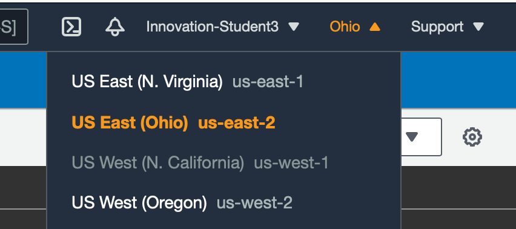

# lab setup

## Lab Setup
In this lab you will log into the AWS Console and start a CloudShell session. We will be using this for all future labs. 

### Log into the AWS Cloud Console
Log into the [AWS Console](https://console.aws.amazon.com) in a browser. Once you have logged in, on the top right side, select the `US-East-2` region. 



### Start the CloudShell 
After selecting the `US-East-2` region, use the search bar at the top of the page to search for `CloudShell`. Click on the result shown in the screenshot.


## Cleanup
Remove any files from previous training sessions. 
```bash
rm -rf * && rm -rf .local
```
## SSH to Tower machine
To log into the Ansible Tower machine, please download the SSH key by running the following command in the terminal:
```
wget --no-check-certificate --content-disposition https://raw.githubusercontent.com/jruels/ansible-best-practices/main/keys/lab.pem
```

Change permissions on the key
```
chmod 600 lab.pem
```

Confirm you can log into the Ansible Tower VM.
```
ssh -i lab.pem ec2-user@<IP from spreadsheet>
```

If prompted, accept the key by typing 'yes'

You should now be logged into the Ansible Tower machine through SSH.

To confirm this you can run:
```
echo $HOSTNAME
```

You should see output similar to:

```
ip-172-31-24-169.us-west-1.compute.internal
```

## Congratulations
You are now logged into the AWS CloudShell, and ready for future labs. 
